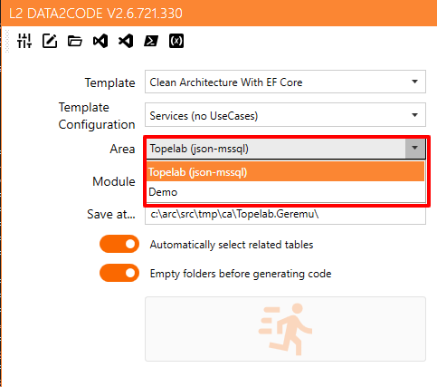

# L2 Data2Code 

Have a database and want to generate code?

Have an idea of data model and want to generate code for that idea?

Only needs a template, a data source (from database or from JSON file) and L2 Data2Code.

## What is L2 Data2Code?

A simple definition would be a code generator. But is more than a simple code generator from a data source. It gets all the info from the data source (actually, from a data base or JSON file), then merge with a template.

A template is a set of files with a special syntax based on Mustache to define the result.
Normally, a template set is composed by a `templates.xml` file on the project root and then one or more directories where templates of files are located.

You can see a sample structure with some files at `SampleData` at current execution path of this application.

## Build solution

You can load sln file with Visual Studio 2019 (Community it's OK) or run `dotnet build` from cmd line at directory containing sln file.

## Sample files

_.\\templates.xml_

```xml
<?xml version="1.0" encoding="utf-8"?>
<TemplateLibrary
  xmlns:xsi="http://www.w3.org/2001/XMLSchema-instance"
  xmlns:xsd="http://www.w3.org/2001/XMLSchema">
	<Global Vars="" FinalVars="" />
	<Templates>
		<Template Name="Demo template"
			  ResourcesFolder="Test"
			  Company="Company"
			  Area="Area"
			  Module="Module"
			  SavePath="c:\src\tmp\{{Company}}\{{Area}}"
			  UserVariables="Version=1.0.0;ApplicationTitle={{Company}} Demo Template {{Area}}"
			  SolutionType = "vsc,*.md,code.cmd,{directory}">
			<PostCommands>
				<Command Name="Build" Directory="{{SavePath}}" Exec="code ." ShowWindow="false" />
			</PostCommands>
		</Template>
	</Templates>
</TemplateLibrary>
```

Template files are files that can contains Mustache expressions, in names and in its content. 

_.\\Test\\{{Area}}.{{Module}}\\Hello-{{Entity}}.md_

```md
## {{Entity}}

Hello {{Entity}}!
```

Context that will be used for replacement is:

```json
{
	"Replacement": {
		"Entity": "Entity",
		"Module": "string",
		"Area": "string",
		"Company": "string",
		"TableName": "string",
		"TableNameOrEntity": "string",
		"IgnoreColumns": ["sting", "string", "..."],
		"UnfilteredColumns": [ "Property", "Property", "..." ],
		"GenerateBase": "bool",
		"GenerateReferences": "bool",
		"IsView": "bool",
		"IsUpdatable": "bool",
		"Description": "string",
		"ConnectionString": "string",
		"DataProvider": "string",
		"Vars": "Dictionary_string_object",
		"AllColumns": [ "Property", "Property", "..." ],
		"Columns": [ "Property", "Property", "..." ],
		"PersistedColumns": [ "Property", "Property", "..." ],
		"ForeignKeyColumns": [ "Property", "Property", "..." ],
		"Collections": [ "Property", "Property", "..." ],
		"HasCollections": "bool",
		"HasForeignKeys": "bool",
		"NotPrimaryKeyColumns": [ "Property", "Property", "..." ],
		"PrimaryKeys": [ "Property", "Property", "..." ],
		"NotPrimaryKeys": [ "Property", "Property", "..." ],
		"HasNotPrimaryKeyColumns": "bool",
		"HasPrimaryKeyColumns": "bool",
		"MultiplePKColumns": "bool",
		"IsWeakEntity": "bool", 
		"Keys": ["string", "string", "..."],
		"Values": ["object", "object", "..."],
		"Count": "int",
		"IsReadOnly": "bool",
		"CanCreateDB": "bool",
	}
}
```

Definition for **Entity**:

```json
	"Entity": {
		"Name" : "string",
		"UseSpanish": "bool",
		"Uppercase": "string",
		"Lowercase": "string",
		"Plural": "string",
		"ToPlural": "string",
		"Singular": "string",
		"ToSingular": "string",
		"LowerCamelCase": "string",
		"Camelize": "string",
		"Pascalize": "string",
		"Humanize": "string",
		"HumanizeUnCapitalize": "string",
		"UnCapitalize": "string",
		"PluralCamelize": "string",
		"SingularCamelize": "string",
		"MultiplePKColumns": "bool",
	}
}
```

Definition for **Property**:

```json
	"Property": {
		"Name": "string",
		"IdOrName": "string",
		"Table": "string",
		"Nullable": "bool",
		"PrimaryKey": "bool",
		"IsFirst": "bool",
		"IsLast": "bool",
		"IsForeignKey": "bool",
		"IsCollection": "bool",
		"DefaultValue": "string",
		"Type": "string",
		"OverrideDbType": "string",
		"DbTypeOverrided": "bool",
		"NullableType": "string",
		"HasMaxLength": "bool",
		"Description": "string",
		"ColumnName": "string",
		"ColumnNameOrName": "string",
		"PkOrder": "int",
		"IsAutoIncrement": "bool",
		"IsComputed": "bool",
		"MultiplePKColumns": "bool",
		"Precision": "int",
		"Scale": "int",
		"IsNumeric": "bool",
		"IsString": "bool",
		"IsDateOrTime": "bool",
		"Join": "string",
		"FromField": "string",
		"ToField": "string",
		"DbJoin": "string",
		"DbFromField": "string",
		"DbToField": "string",
		"FirstSample": "string",
		"Sample": "string",
		"NextSample": "string",
		"IsNameDifferentToColumnName": "bool",
	}

}
```


## Specification for appsettings.json

Here we will define settings for the application: data sources, templates that will use, etc... It has 6 sections: appSettings, Templates, Vars, Schemas, Areas and Modules.

### appSettings section

- **Editor**: "VSCODE" or path to an editor.
- **Editor2**: same as *Editor* to an alternative editor.
- **TemplatesBasePath**: Base path for templates.
- **UICulture** `es|ca|en`: if not defined, application will try to use UI culture if is one of English, Spanish or Catalan. It can be set to `es` or `ca` on `en` to set UI culture for the application.
- **showVarsWindow** `true|(false)`: when `true`, defined vars could be showed in a window.
- **generateJsonInfo** `true|(false)`: when `true`, a JSON info will be generated from data source (if input data source is not a json file) at log file if *JsonGeneratedPath* is not defined.
- **JsonGeneratedPath** `true|(false)`: the path on which JSON file will be generated when *generateJsonInfo* is `true`.
- **Encoding** `(utf8)|latin1`: establish encoding for output files.
- **EndOfLine** `(crlf)|lf|cr`: establish end of line for output files.

### Templates section

A collection of template settings that makes a list of templates available for the application.


Every template has a name and these properties:

- **Path**: relative path from *TemplatesBasePath* on which resides resource templates.
- **Resource**: name of the folder that have files to process.
- **RemoveFolders** `(true)|false`: folders will be removed before generation.

```json
    "Templates": {
        "Clean Architecture With EF Core": {
            "Path": "Topelab\\CleanArchitectureWithEFCore",
            "Resource": "1-General"
        },
        "SimpleDapper Repo": { "Path": "Topelab\\SimpleDapper.Repositories" },
        "Test Demo": {
            "Path": "Topelab\\CleanArchitectureWithEFCore",
            "Resource": "Test"
        }
	}
```

### Vars section

A collection of vars configuration that will be showed as *Template Configuration* in UI.


Every var definition contains a name and a value: 

- **Name**: *TemplateName[.NameOfVar]*. *TemplateName* indicates name of one of the templates defined on [template section](#templates-section). Every *NameOfVar* will be showed as *Template Configuration* in UI.
- **Value**: A collection of values separated by a semicolon (see [Vars attribute](#vars-attribute) for syntax).


```json
    "Vars": {
        "Clean Architecture With EF Core": "SetDomain=;SetAdapters=;SetBusiness=;SetServices=;SetUseCases=;SetWebApiControllers=;SetWebApi=;SetUCDelete=;SetUCGet=;SetUCGetList=;SetUCInsert=;SetUCUpdate=;",
        "Clean Architecture With EF Core.Services (no UseCases)": "SetServices=1;",
        "Clean Architecture With EF Core.Business (no UseCases)": "SetBusiness=1;",
        "Clean Architecture With EF Core.Adapters (no UseCases)": "SetAdapters=1;",
        "Clean Architecture With EF Core.Web Api (only GetList)": "SetWebApi=1;SetUCGetList=1;",
        "Clean Architecture With EF Core.Api Controllers (only GetList)": "SetWebApiControllers=1;SetUCGetList=1;",
        "Clean Architecture With EF Core.UseCases (only GetList)": "SetUseCases=1;SetUCGetList=1;",
        "Clean Architecture With EF Core.Domain (only GetList)": "SetDomain=1;SetUCGetList=1;",
        "Clean Architecture With EF Core.Web Api": "SetWebApi=1;SetUCDelete=1;SetUCGet=1;SetUCGetList=1;SetUCInsert=1;SetUCUpdate=1;",
        "Clean Architecture With EF Core.Api Controllers": "SetWebApiControllers=1;SetUCDelete=1;SetUCGet=1;SetUCGetList=1;SetUCInsert=1;SetUCUpdate=1;",
        "Clean Architecture With EF Core.Adapters": "SetAdapters=1;SetUseCases=1;SetUCDelete=1;SetUCGet=1;SetUCGetList=1;SetUCInsert=1;SetUCUpdate=1;",
        "Clean Architecture With EF Core.UseCases": "SetUseCases=1;SetUCDelete=1;SetUCGet=1;SetUCGetList=1;SetUCInsert=1;SetUCUpdate=1;",
        "Clean Architecture With EF Core.Domain": "SetDomain=1;SetUCDelete=1;SetUCGet=1;SetUCGetList=1;SetUCInsert=1;SetUCUpdate=1;"
    }
```

### Schemas section

Area combo will be filled with information supplied at this section:



Schema definition (defined with a **name**):

- **ConnectionString**: string that defines the connection for data source that can be a data base, a json file with a specific configuration, a path to a dll file, or blank.
- **Provider** `System.Data.[FakeClient | SqlClient | MySqlClient | JsonClient | ObjectClient]`: provider for data source. Every provider has its own syntax for connection string:
  - `FakeClient`: blank string.
  - `SqlClient | MySqlClient`: normal connection string used with this providers.
  - `JsonClient`: path to json file (special format)
  - `ObjectClient: path to .net assembly (dll) and optional, a namespace to filter types separate from path with a semicolon.
- **TableNameLanguage** `(en)|es`: table and column names language on data source. This is used on gender and number functions.
- **RemoveFirstWordOnColumnNames** `true|(false)`: If column names start with a word and an underscore, for example `ta_code`, setting this property to `true`will remove that first word, in our case `ta_` will be removed.
- **DescriptionsFile**: path to tab separate file on each line defines description for a table or a column:
	```
	table<tab>description for a table
	table.column<tab>description for column in table
	```
- **RenameTables**: semicolon separated named values strings `old_table_name=new_table_name`.
- **RenameColumns**: semicolon separated named values strings `old_column_name=new_column_name` or more specific `old_table_name.old_column_name=new_column_name`.
- **CanCreateDB** `true|(false)`: this property will expose to templates its value if input data source is different that output data source.
- **NormalizedNames** `true|(false)`: When is true, then *ColumnNameOrName* will print *Name* and *TableNameOrEntity* will print *Entity*. When is false then *ColumnNameOrName* will print *ColumnName* and *TableNameOrEntity* will print *TableName*.

```json
    "Schemas": {
        "general": {
            "ConnectionString": "",
            "Provider": "System.Data.FakeClient",
            "TableNameLanguage": "en",
            "RemoveFirstWordOnColumnNames": false,
            "DescriptionsFile": null,
            "RenameTables": null
        },
        "northwindtest": {
            "ConnectionString": "SampleData\\northwind-dbinfo.json",
            "Provider": "System.Data.JsonClient",
            "TableNameLanguage": "en",
            "RemoveFirstWordOnColumnNames": false,
            "DescriptionsFile": null,
            "RenameTables": null,
            "RenamaColumns": null
        },
        "northwind-entities": {
            "ConnectionString": "SampleData\\Northwind.ERP.Domain.dll;Northwind.ERP.Domain.Entities",
            "Provider": "System.Data.ObjectClient",
            "TableNameLanguage": "en",
            "RemoveFirstWordOnColumnNames": false,
            "DescriptionsFile": null,
            "RenameTables": null,
            "RenamaColumns": null
        }
    },

```

## Specification for templates.xml

### Global element

#### Vars attribute

It is a quite simple definition of vars that will be using in templates files. Each var is separated from the other with a semicolon and is defined in two parts: name and definition, `var1=value1; var2=value2;`.

Is possible to define a conditional assignation: `if var1=value1 var2=value2;`. Only `=` is supported. If the next var start with a `.` then previous condition will be used:

```xml
	<Global Vars="
		Version=1.0.0;
		VersionSuffix=;
		ApplicationName={{Area}}.{{Module}};
		ApplicationTitle={{Company}} {{Area.Humanize}} {{Module}};

		if database=mysql UseDB=MySql;
		  .UsingMySqlDB=1;
		if database=sqlserver UseDB=SqlServer;
		  .UsingSqlServerDB=1;
		if database=fake UseDB=Sqlite;
		  .UsingSqliteDB=1;
		if database=json UseDB=Sqlite;
		  .UsingSqliteDB=1;
		if database=sqlite UseDB=Sqlite;
		  .UsingSqliteDB=1;
		if database=object UseDB=Sqlite;
		  .UsingSqliteDB=1;

		SetDomain=;SetAdapters=;SetBusiness=;SetServices=;SetUseCases=;SetWebApiControllers=;SetWebApi=;
		SetUCDelete=;SetUCGet=;SetUCGetList=;SetUCInsert=;SetUCUpdate=;
    SetDefaultModels=1;
		"
	  FinalVars="
		if SetWebApi=1 SetWebApiControllers=1;
		if SetWebApiControllers=1 SetUseCases=1;
		if SetUseCases=1 SetBusiness=1;
		if SetServices=1 SetBusiness=1;
		if SetBusiness=1 SetAdapters=1;
    if SetServices=1 SetModels={{SetDefaultModels}};
		if SetAdapters=1 SetDomain=1;
		"
		/>

```

#### FinalVars attribute

It is the same as Vars attribute, but it evaluates vars after the Vars attribute.

### Templates element

Contains a collection of *Template* definitions. Every template section defines a collection of files in its own directory that will be merged with a data source to get an output.

#### Template element

Attributes for a *Template* element:

- **Name**: Name for humans.
- **ResourcesFolder**: Name of folder for resource templates (files or folders). This name is used as an identification for template.
- **Company**: Special var that contains company name (or what else you want) to use inside template files or in *Vars* / *FinalVars* specification.
- **Area**: Special var that contains area or section name (or what else you want) to use inside template files or in *Vars* / *FinalVars* specification.
- **Module**: Special var that contains module name (or what else you want) to use inside template files or in *Vars* / *FinalVars* specification.
- **SavePath**: string that contains output path. It can use any defined variable inside. Example: `"c:\src\tmp\{{Company}}\{{Area}}.{{Module}}-{{Version}}"`.
- **IgnoreColumns**: Collection of columns separated by semicolons to be ignored when traversing the entity properties.
- **UserVariables**: attribute to define more variables. This uses same syntax as [Global.Vars](#vars-attribute).
- **SolutionType**: *(in future versions, SolutionType will be moved to appsettings.json)* Application can open different types of solutions, not only Visual Studio solutions, you can specify property *SolutionType* on template. This is a comma separated string with 4 fields:
    - field 1 (*AppType*): `vs` (Visual Studio), `vsc` (Visual Studio Code), `nb` (Apache Netbeans), `ec` (Eclipse), `ij` (IntelliJIdea). Default: `vs`
    - field 2 (*SearchExpression*): file pattern to search. Default `*.sln`
    - field 3 (CommandLine): program to open solution. Default `{file}`
    - field 4 (*CommandArguments*): arguments for command line used. Default empty string.
	
	We can use replacement `{file}`, `{directory}` or `{parent}` on *CommandLine* and *CommandArguments*:
	- `{file}` represents file or files found with *SearchExpression*
	- `{directory}` is the path for the file (without the file name)
	- `{parent}` is the path for parent directory.
- **IsGeneral**: string with `true` or `false` indicates if this template is a general template, this collection of files will be not used for any of the entities or tables from data source.
- **NextResource**: *ResourcesFolder* name for the next template that will be resolved.
- **PreCommands and PostCommands elements**:

  - PreCommands will be executed before output is being generated.
  - PostCommands will be executed after output is generated.
  - Both PreCommands and PostCommands have same attributes: *Name*, *Directory*, *Exec*, *ShowWindow*, *ShowMessages*, *ShowMessageWhenExitCodeNotZero* and *ShowMessageWhenExitCodeZero*. All *ShowMessage* attributes are true by default.
  - Example:
    ```xml
    <PostCommands>
		<Command Name="Build" Directory="{{SavePath}}" Exec="dotnet build" ShowWindow="false" />
    </PostCommands>
    ```


## Change history

:[changes.md](./changes.md)

## Known issues

:[issues.md](./issues.md)
