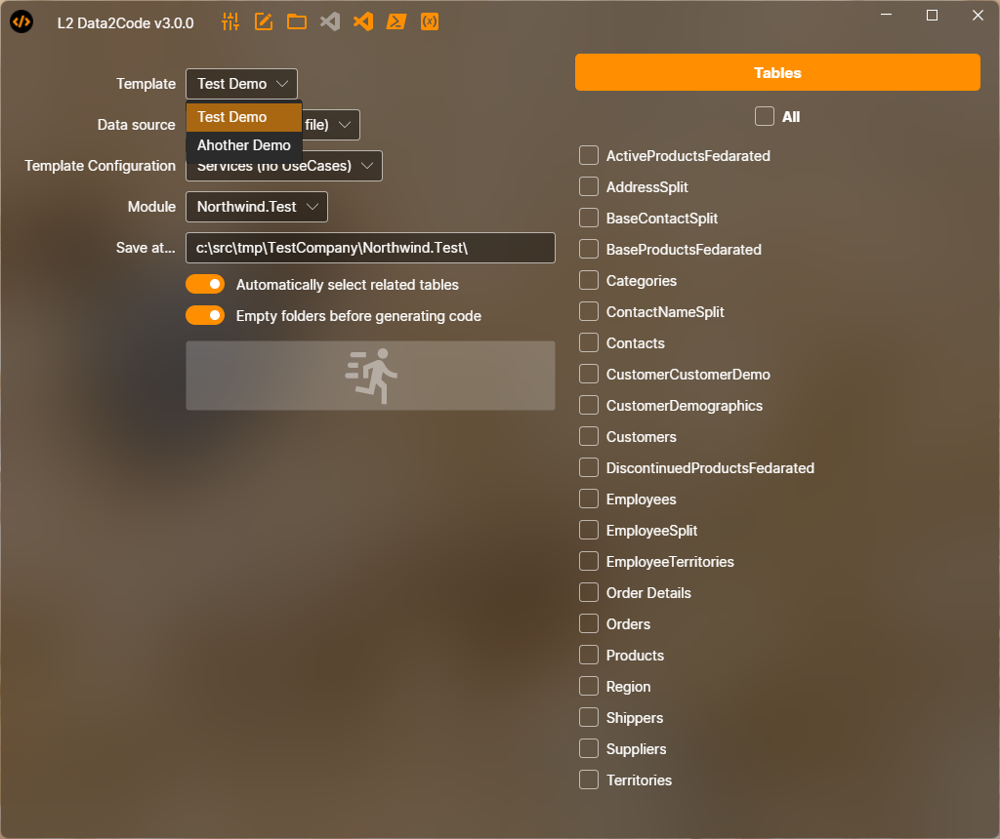
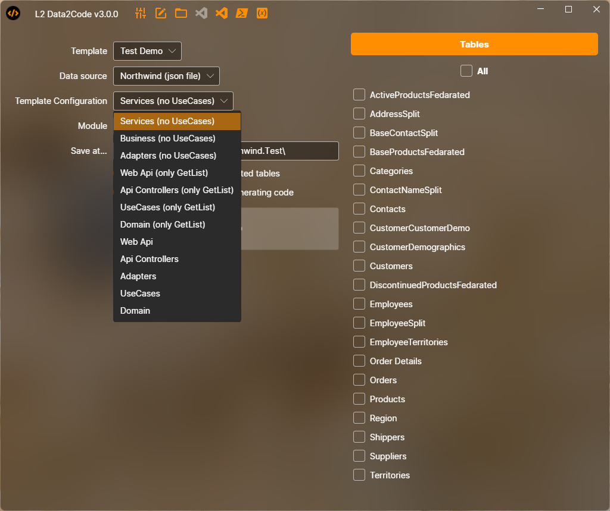
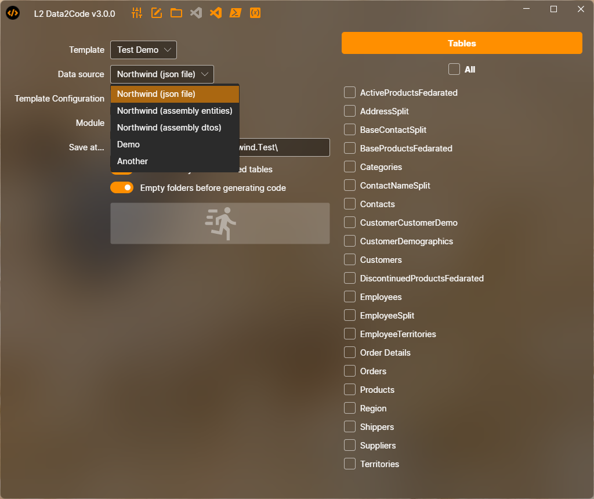
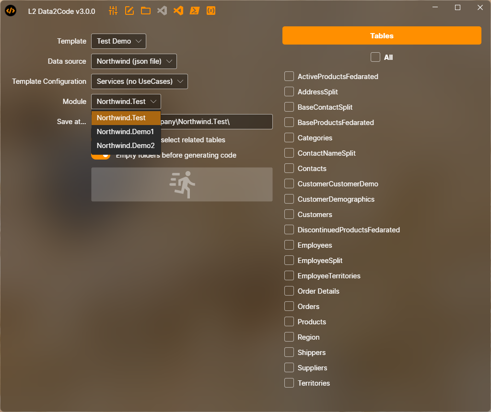

# L2Data2Code v3

## What is L2Data2Code v3?

It's an evolution for L2Data2CodeWPF built using AvaloniaUI. At the moment, only presentation has been changed, all the functionality remains the same as L2Date2CodeWPF.

A simple definition would be a code generator. But is more than a simple code generator from a data source. It gets all the info from the data source (actually, from database, from special JSON file or from an .NET assembly), then merge with a template.

A template is a set of files with a special syntax based on Mustache to define the result.

Normally, a template set is composed by a `JSON` file on the project root and then one or more directories where templates of files are located. This template file is referenced at `appsettings.json` file at **TemplateSettings** node.

## How its work?

In this solution we have a sample set of files and configuration template to test an initial playground. You can see a sample structure with some files at `SampleData` at current execution path of this application.

First file founded at current execution path is `appsettings.json` with a minimum structure:

- *appSettings* section

### Specification for appsettings.json

Here we will define settings for the application: data sources, templates that will use, etc... It has 5 sections: appSettings, Templates, Schemes, Areas and Modules. You can define a minimum **appsettings.json** with only *appSettings* section, and the rest of sections inside another JSON file (it will be specified at **TemplateSettings** key)

#### appSettings section

- **Editor**: "VSCODE" or path to an editor.
- **Editor2**: same as *Editor* to an alternative editor.
- **TemplatesBasePath**: Base path for templates.
- **UICulture**: `es-ES|ca-ES|en`: if not defined, application will try to use UI culture if is one of English, Spanish or Catalan. It can be set to `es-ES` or `ca-ES` on `en` to set UI culture for the application.
- **showVarsWindow**: `true|(false)`: when `true`, defined vars could be showed in a window.
- **generateJsonInfo**: `true|(false)`: when `true`, a JSON info will be generated from data source (if input data source is not a JSON file) at log file if *JsonGeneratedPath* is not defined.
- **JsonGeneratedPath**: `true|(false)`: the path on which JSON file will be generated when *generateJsonInfo* is `true`.
- **Encoding**: `(utf8)|latin1`: establish encoding for output files.
- **EndOfLine**: `(crlf)|lf|cr`: establish end of line for output files.
- **TemplateSettings**: relative path (from application running path) to file that contains other sections.

### Specification for file specified in *TemplateSettings*

#### Templates section

A collection of template settings that makes a list of templates available for the application.




Every template has a name and these properties:

- **Name**: Name for humans.
- **Path**: relative path from *TemplatesBasePath* on which resides resource templates.
- **RemoveFolders** `(true)|false`: folders will be removed before generation.
- **ResourcesFolder** `"General"`: Name of folder for resource templates (files or folders). This name is used as an identification for template. If *IsGeneral* is true, this folder will be processed globally.
- **ItemsResources** `[]`: array of folder resources that will be processed for every entity.
- **Partials** `"partials"`: Name of the folder for `*.partial` files.
- **Company**: Special var that contains company name (or what else you want) to use inside template files or in *Vars* / *Configurations* / *FinalVars* specification.
- **Area**: Special var that contains area or section name (or what else you want) to use inside template files or in *Vars* / *Configurations* / *FinalVars* specification.
- **Module**: Special var that contains module name (or what else you want) to use inside template files or in *Vars* / *Configurations* / *FinalVars* specification.
- **IgnoreColumns**: Collection of columns separated by semicolons to be ignored when traversing the entity properties.
- **SavePath**: string that contains output path. It can use any defined variable inside. Example: `"c:\src\tmp\{{Company}}\{{Area}}.{{Module}}-{{Version}}"`.
- **SolutionType**: *(in future versions, SolutionType will be moved to appsettings.json)* Application can open different types of solutions, not only Visual Studio solutions, you can specify property *SolutionType* on template. This is a comma separated string with 4 fields:
    - field 1 (*AppType*): `vs` (Visual Studio), `vsc` (Visual Studio Code), `nb` (Apache Netbeans), `ec` (Eclipse), `ij` (IntelliJIdea). Default: `vs`
    - field 2 (*SearchExpression*): file pattern to search. Default `*.SLN`
    - field 3 (CommandLine): program to open solution. Default `{file}`
    - field 4 (*CommandArguments*): arguments for command line used. Default empty string.
    
    We can use replacement `{file}`, `{directory}` or `{parent}` on *CommandLine* and *CommandArguments*:
    - `{file}` represents file or files found with *SearchExpression*
    - `{directory}` is the path for the file (without the file name)
    - `{parent}` is the path for parent directory.
- **NextResource**: *ResourcesFolder* name for the next template that will be resolved.
- **IsGeneral**: string with `true` or `false` indicates if this template is a general template, this collection of files will be not used for any of the entities or tables from data source.
- **PreCommands and PostCommands elements**:

  - PreCommands will be executed before output is being generated.
  - PostCommands will be executed after output is generated.
  - Both PreCommands and PostCommands have same attributes: *Name*, *Directory*, *Exec*, *ShowWindow*, *ShowMessages*, *ShowMessageWhenExitCodeNotZero*, *ShowMessageWhenExitCodeZero* and *Skip*. All *ShowMessage* attributes are true by default. *Directory*, *Exec* and *Skip* can use compiled vars.
  - Example:
    ```json
    "PostCommands": [
        {
            "Name": "Build",
            "Directory": "{{SavePath}}",
            "Exec": "start .",
            "ShowWindow": false,
            "Skip": {{SkipBuild}} // SkipBuild can be defined on DataSource.Vars collection
        }
    ],
    ```
- **Vars**: A collection of name-value values.
- **Configurations**: A collection of vars configuration that will be showed as *Template Configuration* in UI.

  

  Every var definition contains a name and a value: 

    - **Name**: *NameOfVar* indicates name of one of the configuration that will be showed as *Template Configuration* in UI.
    - **Value**: A collection of values separated by a semicolon.
- **FinalVars**: Its the same as Vars attribute, but it evaluates vars after the Vars collection.


#### Template section example

Now, we can use `Template` inside *SavePath*. In this example `Template = "Test template (global)"`

```json
        "Test Demo": {
            "Name": "Test template (global)",
            "ResourcesFolder": "GlobalFiles",
            "ItemsResources": [ "ItemFiles" ],
            "Partials":  "partials",
            "IsGeneral": true,
            "Company": "TestCompany",
            "Area": "TestArea",
            "Module": "TestModule",
            "SavePath": "c:\\src\\tmp\\{{Company}}\\{{Area}}.{{Module}}",
            "SolutionType": "vsc,*.md,code.cmd,{directory}",
            "PostCommands": [
                {
                    "Name": "Buid",
                    "Directory": "{{SavePath}}",
                    "Exec": "start .",
                    "ShowWindow": false
                }
            ],
            "Vars": {
                "Version": "1.0.0",
                "VersionSuffix": "",
                "ApplicationName": "{{Area}}.{{Module}}",
                "ApplicationTitle": "{{Company.Humanize}} {{Area.Humanize}} {{Module}}",
                "SetDomain": false,
                "SetAdapters": false,
                "SetBusiness": false,
                "SetServices": false,
                "SetUseCases": false,
                "SetWebApiControllers": false,
                "SetWebApi": false,
                "SetUCDelete": false,
                "SetUCGet": false,
                "SetUCGetList": false,
                "SetUCInsert": false,
                "SetUCUpdate": false,
                "SetDefaultModels": true
            },
            "Configurations": {
                "Services (no UseCases)": "SetServices=true;",
                "Business (no UseCases)": "SetBusiness=true;",
                "Adapters (no UseCases)": "SetAdapters=true;",
                "Web Api (only GetList)": "SetWebApi=true;SetUCGetList=true;",
                "Api Controllers (only GetList)": "SetWebApiControllers=true;SetUCGetList=true;",
                "UseCases (only GetList)": "SetUseCases=true;SetUCGetList=true;",
                "Domain (only GetList)": "SetDomain=true;SetUCGetList=true;",
                "Web Api": "SetWebApi=true;SetUCDelete=true;SetUCGet=true;SetUCGetList=true;SetUCInsert=true;SetUCUpdate=true;",
                "Api Controllers": "SetWebApiControllers=true;SetUCDelete=true;SetUCGet=true;SetUCGetList=true;SetUCInsert=true;SetUCUpdate=true;",
                "Adapters": "SetAdapters=true;SetUseCases=true;SetUCDelete=true;SetUCGet=true;SetUCGetList=true;SetUCInsert=true;SetUCUpdate=true;",
                "UseCases": "SetUseCases=true;SetUCDelete=true;SetUCGet=true;SetUCGetList=true;SetUCInsert=true;SetUCUpdate=true;",
                "Domain": "SetDomain=true;SetUCDelete=true;SetUCGet=true;SetUCGetList=true;SetUCInsert=true;SetUCUpdate=true;"
            },
            "FinalVars": {
                "if database=mysql UseDB": "MySql; .UsingMySqlDB=true;",
                "if database=sqlserver UseDB": "SqlServer; .UsingSqlServerDB=true;",
                "if database=sqlite UseDB": "Sqlite; .UsingSqliteDB=true;",
                "if database=fake UseDB": "Sqlite; .UsingSqliteDB=true;",
                "if database=json UseDB": "Sqlite; .UsingSqliteDB=true;",
                "if database=object UseDB": "Sqlite; .UsingSqliteDB=true;",
                "if SetWebApi=true SetWebApiControllers": true,
                "if SetWebApiControllers=true SetUseCases": true,
                "if SetUseCases=true SetBusiness": true,
                "if SetServices=true SetBusiness": "true; .SetModels={{SetDefaultModels}};",
                "if SetBusiness=true SetAdapters": true,
                "if SetAdapters=true SetDomain": true
            }
        },
```

#### Schemes section

Schema definition (defined with a **key**):

- **Key**: string used to identify a schema.
- **ConnectionString**: string that defines the connection for data source that can be a data base, a JSON file with a specific configuration, a path to a DLL file, or blank.
- **Provider**: `System.Data.[FakeClient | SqlClient | MySqlClient | JsonClient | ObjectClient]`: provider for data source. Every provider has its own syntax for connection string:
  - `FakeClient`: blank string.
  - `SqlClient | MySqlClient`: normal connection string used with this providers.
  - `JsonClient`: path to JSON file (special format)
  - `ObjectClient`: path to .net assembly (DLL) and optional, a name space to filter types separate from path with a semicolon.
- **TableNameLanguage**: `(en)|es`: table and column names language on data source. This is used on gender and number functions.
- **RemoveFirstWordOnColumnNames**: `true|(false)`: If column names start with a word and an underscore, for example `ta_code`, setting this property to `true`will remove that first word, in our case `ta_` will be removed.
- **DescriptionsFile**: path to tab separate file on each line defines description for a table or a column:
    ```
    table<tab>description for a table
    table.column<tab>description for column in table
    ```
- **RenameTables**: semicolon separated named values strings `old_table_name=new_table_name`.
- **RenameColumns**: semicolon separated named values strings `old_column_name=new_column_name` or more specific `old_table_name.old_column_name=new_column_name`.
- **CanCreateDB**: `true|(false)`: this property will expose to templates its value if input data source is different that output data source.
- **NormalizedNames**: `true|(false)`: When is true, then *ColumnNameOrName* will print *Name* and *TableNameOrEntity* will print *Entity*. When is false then *ColumnNameOrName* will print *ColumnName* and *TableNameOrEntity* will print *TableName*.
- **OverrideDataBaseId** used to override `database` at `Vars` and it can be used when generating code

```json
    "Schemes": {
        "northwindtest": {
            "ConnectionString": "..\\northwind-dbinfo.json",
            "Provider": "System.Data.JsonClient",
            "TableNameLanguage": "en",
            "RemoveFirstWordOnColumnNames": false,
            "DescriptionsFile": null,
            "RenameTables": null,
            "RenamaColumns": null
        },
        "northwind-entities": {
            "ConnectionString": "..\\Northwind.ERP.Domain.dll;Northwind.ERP.Domain.Entities",
            "Provider": "System.Data.ObjectClient",
            "TableNameLanguage": "en",
            "RemoveFirstWordOnColumnNames": false,
            "DescriptionsFile": null,
            "RenameTables": null,
            "RenamaColumns": null
        },
        "northwind-dtos": {
            "ConnectionString": "..\\Northwind.ERP.Domain.dll;Northwind.ERP.Domain.Dtos",
            "Provider": "System.Data.ObjectClient",
            "TableNameLanguage": "en",
            "RemoveFirstWordOnColumnNames": false,
            "DescriptionsFile": null,
            "RenameTables": null,
            "RenamaColumns": null
        },
        "northwind-collections": {
            "ConnectionString": "..\\Northwind.ERP.Domain.dll;Northwind.ERP.Domain.Collections",
            "Provider": "System.Data.ObjectClient",
            "TableNameLanguage": "en",
            "RemoveFirstWordOnColumnNames": false,
            "DescriptionsFile": null,
            "RenameTables": null,
            "RenamaColumns": null
        }
    },
```

#### Data source section

Data source combo will be filled with information supplied at this section.



This is the data source definition (defined with a **Key**):

- **Key**: *string* used to fill combo.
- **Area**: *string* used like a var inside template files. It can be used as a department or project name inside a company.
- **Schema**: schema key data source.
- **OutputSchema**: schema key for output data source. When using JSON or object schema, by default output schema type is SQLite.
- **Vars**: A collection of name-value values.

```json
    "DataSources": {
        "Northwind (json file)": {
            "Area": "Northwind",
            "Schema": "northwindtest"
        },
        "Northwind (assembly entities)": {
            "Area": "Northwind",
            "Schema": "northwind-entities"
        },
        "Northwind (assembly dtos)": {
            "Area": "Northwind",
            "Schema": "northwind-dtos"
        },
        "Demo": {
            "Area": "Demo",
            "Schema": "general"
        },
        "Another": {
            "Area": "Another",
            "Schema": "general"
        }
    },
```


#### Modules section

Module combo will be filled with information supplied at this section.



```json
    "Modules": {
        "Northwind.Test": { "Name": "Test" },
        "Northwind.Demo1": { "Name": "Demo1" },
        "Northwind.Demo2": { "Name": "Demo2" },
		"Demo.Test": { "Name": "Test" },
        "Another.Test": { "Name": "Test" },
        "Demo.Test2": { "Name": "Test2" }
    }
```

## Build solution

You can load SLN file with Visual Studio 2022 (Community it's OK) or run `dotnet build` from command line at directory containing SLN file.

## Definitions

**Replacement context**:

```json
{
    "Replacement": {
        "Template": "string",
        "Entity": "Entity",
        "Indexes": [ "Index", "Index", "..." ]
        "Module": "string",
        "Area": "string",
        "Company": "string",
        "TableName": "string",
        "TableNameOrEntity": "string",
        "IgnoreColumns": ["sting", "string", "..."],
        "UnfilteredColumns": [ "Property", "Property", "..." ],
        "GenerateBase": "bool",
        "GenerateReferences": "bool",
        "IsView": "bool",
        "IsUpdatable": "bool",
        "Description": "string",
        "ConnectionString": "string",
        "DataProvider": "string",
        "Vars": "Dictionary_string_object",
        "AllColumns": [ "Property", "Property", "..." ],
        "Columns": [ "Property", "Property", "..." ],
        "PersistedColumns": [ "Property", "Property", "..." ],
        "ForeignKeyColumns": [ "Property", "Property", "..." ],
        "Collections": [ "Property", "Property", "..." ],
        "HasCollections": "bool",
        "HasForeignKeys": "bool",
        "NotPrimaryKeyColumns": [ "Property", "Property", "..." ],
        "PrimaryKeys": [ "Property", "Property", "..." ],
        "NotPrimaryKeys": [ "Property", "Property", "..." ],
        "HasNotPrimaryKeyColumns": "bool",
        "HasPrimaryKeyColumns": "bool",
        "MultiplePKColumns": "bool",
        "IsWeakEntity": "bool", 
        "Keys": ["string", "string", "..."],
        "Values": ["object", "object", "..."],
        "Count": "int",
        "IsReadOnly": "bool",
        "CanCreateDB": "bool",
    }
}
```

**Entity**:

```json
    "Entity": {
        "Name" : "string",
        "UseSpanish": "bool",
        "Uppercase": "string",
        "Lowercase": "string",
        "Plural": "string",
        "ToPlural": "string",
        "Singular": "string",
        "ToSingular": "string",
        "LowerCamelCase": "string",
        "Camelize": "string",
        "Pascalize": "string",
        "Humanize": "string",
        "HumanizeUnCapitalize": "string",
        "UnCapitalize": "string",
        "PluralCamelize": "string",
        "SingularCamelize": "string",
        "MultiplePKColumns": "bool",
    }
}
```

**Index**:

```json
    "Index": {
        "Name": "string",
        "IsUnique": "bool",
        "IndexColumns": [ "IndexColum", "IndexColumn", "..." ]
    }
```

**IndexColumn**:

```json
    "IndexColumn": {
        "ColumnName": "string",
        "Name": "string",
        "Order": "int",
        "IsDescending": "bool"
    }
```


**Property**:

```json
    "Property": {
        "Entity": "Entity"
        "Name": "string",
        "IdOrName": "string",
        "Table": "string",
        "Nullable": "bool",
        "PrimaryKey": "bool",
        "IsFirst": "bool",
        "IsLast": "bool",
        "IsForeignKey": "bool",
        "IsCollection": "bool",
        "DefaultValue": "string",
        "Type": "string",
        "OverrideDbType": "string",
        "DbTypeOverrided": "bool",
        "NullableType": "string",
        "HasMaxLength": "bool",
        "Description": "string",
        "ColumnName": "string",
        "ColumnNameOrName": "string",
        "PkOrder": "int",
        "IsAutoIncrement": "bool",
        "IsComputed": "bool",
        "MultiplePKColumns": "bool",
        "Precision": "int",
        "Scale": "int",
        "IsNumeric": "bool",
        "IsString": "bool",
        "IsDateOrTime": "bool",
        "Join": "string",
        "FromField": "string",
        "ToField": "string",
        "DbJoin": "string",
        "DbFromField": "string",
        "DbToField": "string",
        "FirstSample": "string",
        "Sample": "string",
        "NextSample": "string",
        "IsNameDifferentToColumnName": "bool",
    }

}
```


## Change history

:[changes.md](./changes.md)

## Known issues

:[issues.md](./issues.md)
